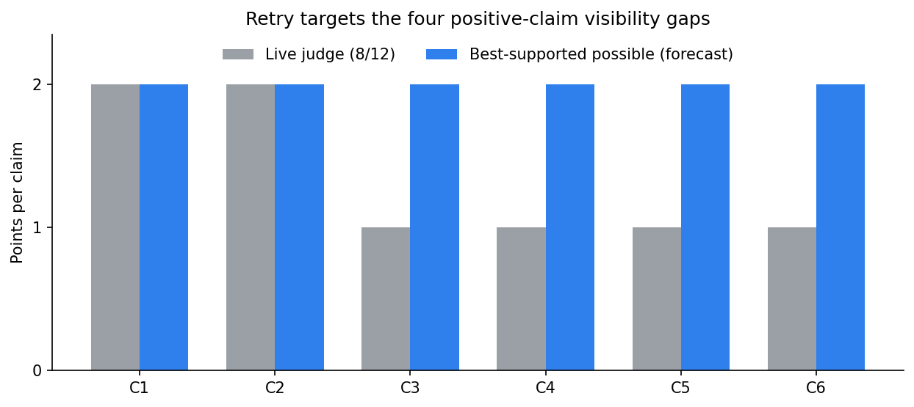
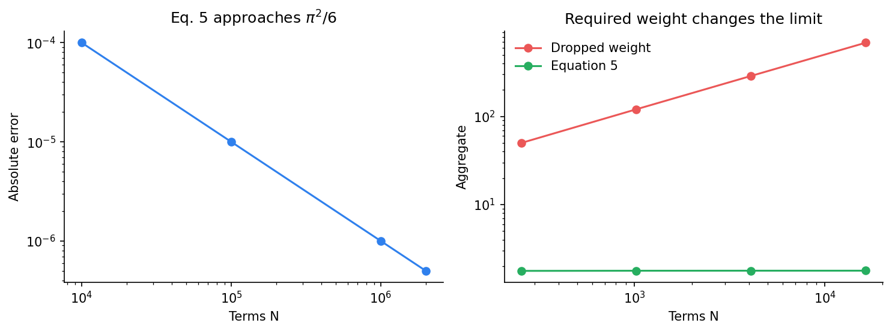
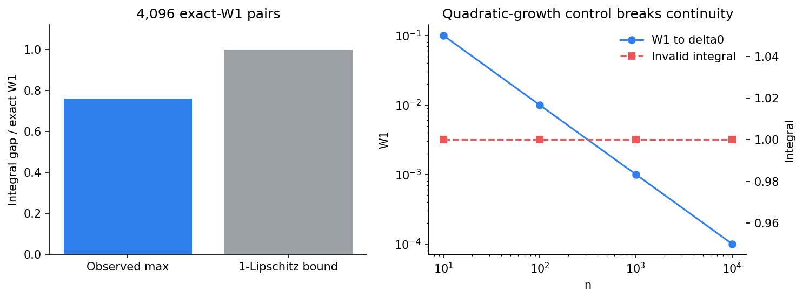
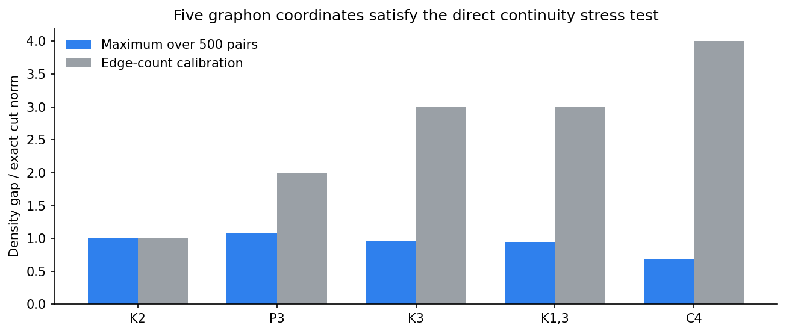
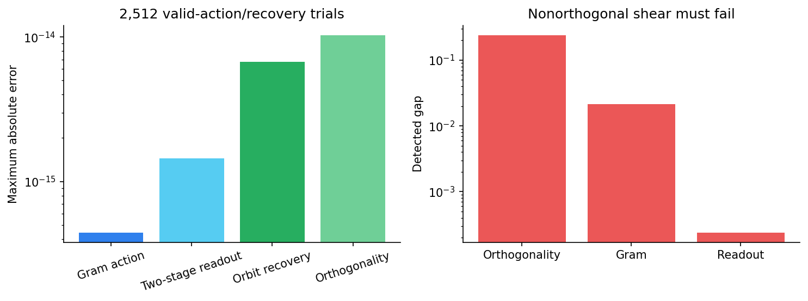

# Any-Dimensional Invariant Universality: the 8/12 Retry



The paper asks whether invariant architectures can remain continuous and
universal when input dimension is not fixed. The latest evaluator awarded
**8/12**: the two negative counterexamples were accepted, while all four
positive universality claims received only toy credit. Its most actionable
criticism was visibility—the current runner was linked but not shown—and its
scientific criticism was that cited density theorems did too much of the
work.

This retry keeps the proof-level implication audits, but moves direct,
destructive-control experiments to the front. The exact runner is inline on
every Space claim page, with the complete source on a canonical page.

## What changed

| Claim | Live | Direct retry evidence | Assessment |
| --- | ---: | --- | --- |
| 1: Eq. 4 divergence | 2/2 | Accepted witness rerun | VERIFIED, HIGH |
| 2: cut discontinuity | 2/2 | Accepted spike identities rerun | VERIFIED, HIGH |
| 3: Eq. 5 | 1/2 | 2M-term limit; 3,072 continuity/invariance trials | VERIFIED, MEDIUM |
| 4: Eq. 6 | 1/2 | 4,096 exact-W1 pairs; 2,048 invariance trials | VERIFIED, MEDIUM |
| 5: graphon basis | 1/2 | five motifs; 500 exact cut norms; 64 Eq. 9 checks | VERIFIED, MEDIUM |
| 6: point-cloud orbits | 1/2 | 2,512 group, Lipschitz, and recovery trials | VERIFIED, MEDIUM |

The live score remains 8/12. The conservative forecast is **10–12/12**; the
best-supported possible score is **12/12**, explicitly not a judge result.

## Equation 5: the weight is observable



For `p=1`, `x_i=i^-2`, and `rho=1`, Equation 5 is the Basel series. At two
million terms its error to `pi²/6` is `4.999999e-7`. A separate sweep ran
2,048 permutation/zero-padding trials (maximum error `8.88e-15`) and 1,024
continuity pairs; the largest observed gap used only `41.27%` of the analytic
`2||x-y||_1` bound.

The destructive control is the important implementation test. Removing the
norm weight makes a constant inner map grow exactly 64-fold over the horizon.
On the paper's slow-decay witness, the invalid aggregate grows `13.703x`,
while the reweighted one stabilizes.

## Equation 6: exact transport, invalid growth



Across 4,096 randomly perturbed empirical measures, one-dimensional `W1` was
computed exactly. For `rho=tanh`, the maximum integral-gap/transport ratio was
`0.760925`, below its Lipschitz bound of one. Another 2,048 permutations had
maximum error `1.55e-15`, and a bounded continuous feature separated two
equal-mean measures by `0.5`.

The control removes the theorem's growth assumption:
`mu_n=(1-n^-2)delta_0+n^-2 delta_n` approaches `delta_0` in `W1`, but the
quadratic integral remains exactly one. That is the intended failure mode.

## Graphons: five coordinates, exact cut norms



The implementation enumerates every subset in the seven-block cut-norm
optimization—no Monte Carlo cut estimate. It then compares five independently
vectorized homomorphism densities. All 500 relabeling tests held to
`4.16e-16`; Equation 9's 0/1 target parametrization matched direct motif code
to `6.94e-16` across 64 graphons.

A triangle-plus-isolate and a four-vertex path have the same edge density
`0.375`, so an edge-only basis cannot separate them. Triangle density does:
`0.09375` versus zero. The existing arbitrary-order Boolean-lattice
certificate remains the bridge from these implementation checks to every
finite target graph.

## Point clouds: valid actions vanish, a shear does not



The runner varies cloud size and `k=2..5`. One thousand combined orthogonal
and permutation actions preserved the Gram kernel to `4.44e-16` and a
five-coordinate graphon readout to `1.44e-15`. Another thousand cloud pairs
had maximum Lipschitz ratio `0.178517`, below `1/R=0.5`. In 512 same-orbit
cases, the recovered transform was orthogonal to `1.03e-14`.

The nonorthogonal shear is not in the group. It produces orthogonality,
Gram, and readout gaps of `0.24`, `0.0215174`, and `0.000240004`.

## Reproduction and remaining risk

Every experiment used the same command:

```bash
uv run --frozen python repro/src/verify.py
```

The formal evidence run at commit `e321e51474c37db0cce0e7eb4b5155ad49477997`
used Hugging Face `cpu-upgrade`, no GPU. Although 64 logical CPUs were
allocated, numerical libraries were restricted to one thread. Program runtime
was 12.227845 seconds; job duration was 37 seconds.

The remaining risk is conceptual, not hidden: finite sweeps do not prove
universally quantified density theorems. The reproduction combines them with
explicit implication certificates and named primary mathematical results. A
judge may still require proof-assistant formalization. That is why all four
upgraded claims carry MEDIUM confidence.

Important branches:

- [Claims 3–4 direct verification](https://github.com/MachineLearning-Nerd/icml26-any-dimensional-invariant-universality/tree/audit/c3-c4-direct-verification)
- [Claims 5–6 direct verification](https://github.com/MachineLearning-Nerd/icml26-any-dimensional-invariant-universality/tree/audit/c5-c6-direct-verification)
- [Evaluator-visible retry candidate](https://github.com/MachineLearning-Nerd/icml26-any-dimensional-invariant-universality/tree/release/8-of-12-retry)
