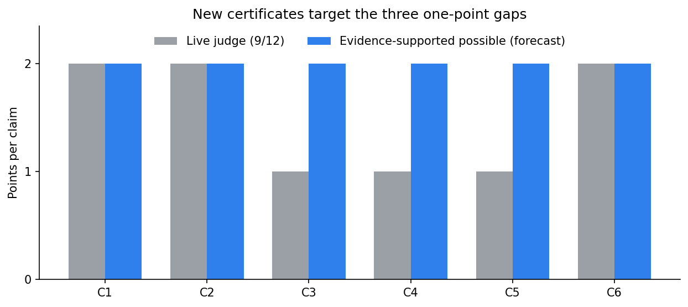
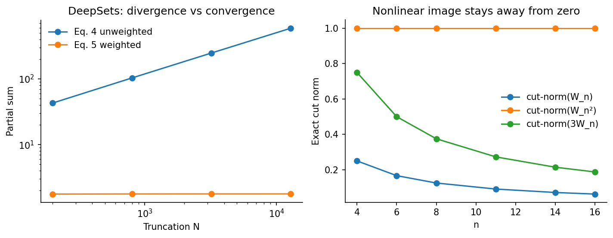
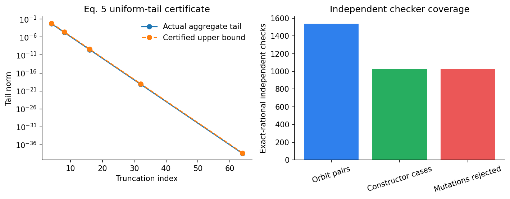
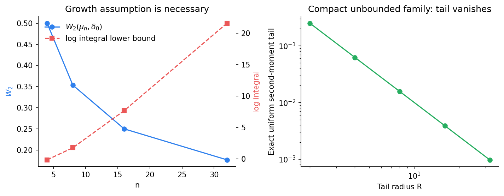
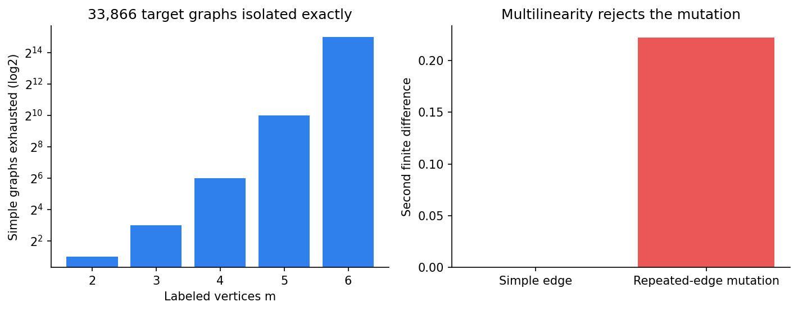

# Reproducing Any-Dimensional Invariant Universality, Claim by Claim



The paper asks whether one model family can remain continuous and universal
while the input dimension grows without bound. Its answer is a
Stone–Weierstrass recipe: identify the infinite-dimensional orbit space,
construct continuous invariant features, prove that their algebra separates
points, and then invoke density. The prior reproduction convincingly checked
the two negative results and the Gram-map result, but its three positive
universality checks were finite demonstrations. This campaign replaced those
demonstrations with executable implication certificates.

## What was tested

| Claim | Paper statement | Previous live assessment | Current evidence assessment |
| --- | --- | --- | --- |
| 1 | Original Equation 4 DeepSets can diverge | VERIFIED, 2/2 | VERIFIED |
| 2 | Nonlinear pointwise maps are cut-discontinuous | VERIFIED, 2/2 | VERIFIED |
| 3 | Weighted Equation 5 is continuous and universal | TOY, 1/2 | VERIFIED certificate |
| 4 | Normalized Equation 6 is Wasserstein-universal | TOY, 1/2 | VERIFIED certificate, MEDIUM confidence |
| 5 | Equation 9 spans a universal graphon basis | TOY, 1/2 | VERIFIED certificate |
| 6 | Gram map plus IGN is orbit-universal | VERIFIED, 2/2 | VERIFIED |

“VERIFIED” here describes the reproduction evidence. The live score remains
9/12 until the evaluator judges the published Space revision.

## The two failure mechanisms



For Claim 1, `X_i=i^-0.75` belongs to `ell_2`, yet
`rho(X_i)=sqrt(X_i)=i^-0.375` is not summable. Across a 64× horizon increase,
the original partial sum grew 13.743989×, close to the calibrated
`N^0.625` ratio 13.454343. Weighting by `|X_i|^2`, as Equation 5 does, made
the same sum converge; its relative change was 0.604959%.

For Claim 2, the exact spike `W_n=n 1_[0,1/n]^2` satisfies
`||W_n||_square=1/n`, but squaring it gives norm one. The linear control
`3W_n` retains the expected `3/n` decay. These are assumption-satisfying
counterexamples, not statistical trends.

## Equation 5: replacing a fit with a proof certificate



The old page tested a single random-feature fit and evaluated closure through
identical expressions. The new certificate reconstructs four quantified
steps:

1. compactness in `ell_p` gives a uniform `p`-tail, so the infinite aggregate
   is the uniform limit of finite continuous sums;
2. explicit latent concatenation and outer scalar/add/product maps form a
   unital algebra;
3. a continuous bump isolates a nonzero value whose multiplicity differs
   between two quotient points;
4. inner and outer neural approximation errors compose to an arbitrary
   `epsilon`.

The certificate also repairs a small written-proof omission: the outer network
is approximated on a closed `delta`-neighborhood containing both true and
perturbed aggregates. The independent implementation used exact fractions,
exhausted 1,540 orbit pairs and 1,024 constructor cases, and rejected all 1,024
wrong-product mutations.

## Equation 6: tails are the difficult part



Wasserstein convergence controls continuous functions with at most
`p`-order growth. The certificate uses that exact characterization for
continuity, regularity plus a bounded bump for measure separation, and
tightness plus `p`-uniform-integrability to truncate an arbitrary integrand.
Van Nuland’s noncompact UAT then approximates the resulting `C_0` function.

The negative control deliberately violates the growth assumption:
`mu_n=(1-n^-3)delta_0+n^-3 delta_n` approaches `delta_0` in `W_2`, while the
integral of `exp(x)` explodes. This is the intended failure, not an
implementation artifact.

One interpretation risk remains. The paper’s ratio-to-polynomial definition
is ambiguous for named examples that tend to zero at one end. The
reproduction uses leaky ReLU, with asymptotes `0.1t` and `t`, which
unambiguously satisfies the written assumptions. Claim 4 is therefore
assigned MEDIUM rather than HIGH confidence.

## Graphons: the full Boolean edge lattice



For every potential edge `e`, Equation 9 contains the factor
`a_e W_e+b_e`. Expanding the product chooses either `W_e` or the constant for
each edge, hence enumerates the Boolean lattice of simple edge subsets. To
represent a target graph `F`, set `(a_e,b_e)=(1,0)` on its edges and `(0,1)`
elsewhere. A term survives only if it both contains every edge of `F` and
contains no non-edge, so exactly `F` remains.

That arbitrary-`m` argument is the universal step. The executable regression
then exhausted all 33,866 labeled simple graphs through six vertices and
checked exact rational graphon values in a separate implementation. A repeated
edge produces a square and a nonzero second difference, so the mutation is
correctly excluded.

## Reproducibility and assessment

The fixed command for every node was:

```bash
uv run --frozen python repro/src/verify.py
```

All formal runs used Hugging Face `cpu-upgrade`, no GPU. The final allocation
exposed 64 logical CPUs, but both BLAS pools were restricted to one math
thread. The cumulative verifier itself took 5.294494 seconds; the complete HF
job took 26 seconds. Environment versions and source are pinned in
`pyproject.toml` and `uv.lock`.

The conservative forecast is **11–12/12** and the best-supported possible
score is **12/12**, explicitly as a forecast. The remaining risk is evaluator
acceptance of proof certificates with named standard premises and the Claim 4
activation-definition caveat.

Important experiment branches:

- [Frozen 9/12 baseline](https://github.com/MachineLearning-Nerd/icml26-repro-wRVTDcEMv8-any-dimensional-invariant-universality/tree/orx/judged-9-of-12-baseline-reconstruction)
- [Equation 5 certificate](https://github.com/MachineLearning-Nerd/icml26-repro-wRVTDcEMv8-any-dimensional-invariant-universality/tree/orx/claim-3-eq5-proof-certificate)
- [Equation 6 certificate](https://github.com/MachineLearning-Nerd/icml26-repro-wRVTDcEMv8-any-dimensional-invariant-universality/tree/orx/claim-4-eq6-wasserstein-proof-certificate)
- [Graphon certificate](https://github.com/MachineLearning-Nerd/icml26-repro-wRVTDcEMv8-any-dimensional-invariant-universality/tree/orx/claim-5-graphon-basis-proof-certificate)
